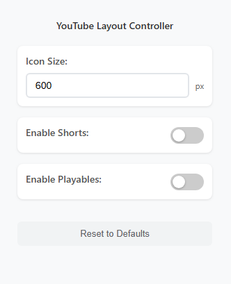

# YouTube-QOL

Really crappy chrome extension to fix some of their BS layout design changes. Code is absolute trash and inefficient but it works just well enough...

    

### Features:

- Extension UI to adjust YouTube layout
- Custom video thumbnail size on homepage
- Toggle on/ off Shorts shelf on homepage and search results
- Toggle on/ off Playables shelf on homepage and search results

### Does not support:

- Custom video thumbnail size on search results
- No customization is allowed on channel pages

### Known issues:

- Will break if youtube changes element name
- YouTube has thumbnail loading issues if you display too many videos per page
- YouTube page does not refresh/ update when toggle value changes

### Instalation Guide:
Since this is not an official extension, install is kinda janky.

0. [Optional] Clone/ Fork the repo. 
1. Download the repo
    - `git clone https://github.com/ihatedwang/youtube_qol.git`
    - or click on the green `Code` button and select `Download Zip`.
2. Go to extensions settings `chrome://extensions/`.
3. Enable `Developer Mode`. This setting can be found top right in the extension settings page.
4. Click on `Load unpacked`. This setting can be found top left in the extension settings page.
5. The extension should now be loaded. You can also pin the extension for ease of access to the UI.